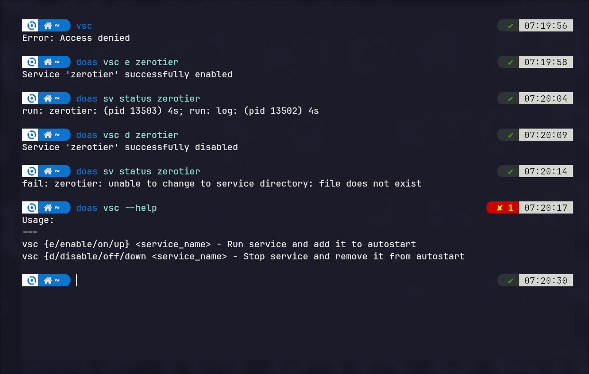

# Void Service Control (VSC)
## A simple script that will allow you to manage runit services in Void Linux

- [Installation](#install)
- [Usage](#usage)
- [Build from sources](#build-from_sources)
- [Example (Screenshot)](#example)


### Install:

**You can install vsc using pip:**

From [git.orudo.ru](https://git.orudo.ru/trueold89/void-service-control/releases):

```bash
$ pip install https://git.orudo.ru/trueold89/void-service-control/releases/download/0.2/VoidServiceControl-0.2.tar.gz
```
or pypi

```bash
$ pip install void-service-control
```

---

**Or by downloading the pre-built binary / xbps-package from the **[releases](https://git.orudo.ru/trueold89/void-service-control/releases)** page**

***

### Usage:

**Enbale service:**

```bash
$ vsc e <service_name>
```

**Disable service:**

```bash
$ vsc d <service_name>
```

**Print help:**

```bash
$ vsc --help
```
*All commands require root privileges*

### Build from sources

**Clone repo:**
```bash
$ git clone https://git.orudo.ru/trueold89/void-service-control.git --depth=1 && cd void-service-control
```

**Install deps:**
```bash
$ pip install setuptools
```

**Build sdist:**
```bash
$ python3 setup.py sdist
```

**Install:**
```bash
$ pip install dist/*
```

*Last command require root privileges*
***

## Example:




