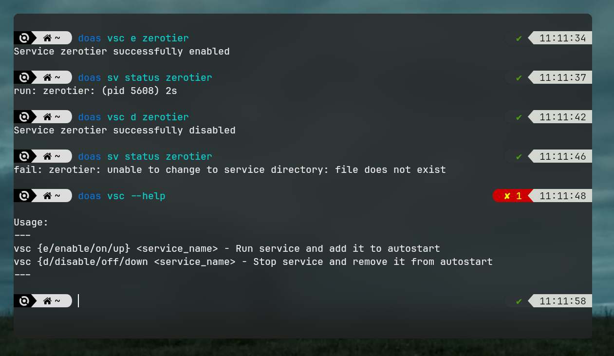

# Void Service Control (VSC)
## A simple script that will allow you to manage runit services in Void Linux

### Usage:

**Enbale service:**

```
vsc e <service_name>
```

**Disable service:**

```
vsc d <service_name>
```

**Print help**

```
vsc --help
```
*All commands require root privileges*

---

## Example:


